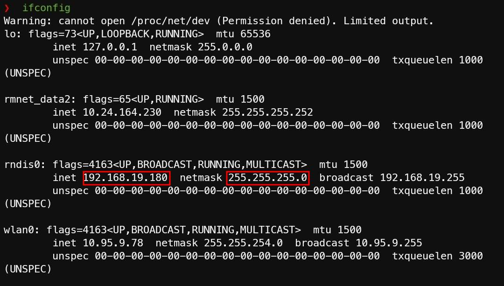
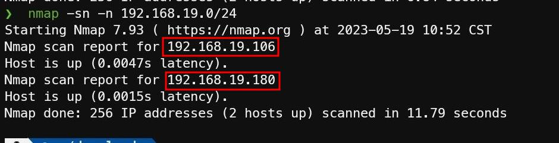

# 网络配置

## 前言

本文档介绍了如何在 Linux 系统中配置网络，以及如何解决一些常见的网络问题。

## 如何连接到一个已开机而未连接网络的树莓派

众所周知，我们常用的两种控制树莓派的方法，一种是通过网络 SSH 或者 VNC 连接，另一种是通过 HDMI 连接显示器。但是，如果我们的树莓派已经开机而未连接到网络，同时我们手头没有显示器，那么我们就无法通过这两种方法来控制树莓派了。

接下来，我们将介绍如何通过网络的方式重新连接到树莓派。

### 借助路由器

需要的硬件：路由器、网线

优点：操作简单

缺点：需要路由器和网线，在某些场景下可能不方便

1. 将路由器的 DHCP 功能打开 （**注意**：大部分路由器默认已经打开了 DHCP 功能，不需要额外操作）
2. 将树莓派通过有线网络连接到路由器
3. 在路由器的管理界面中查看树莓派的 IP 地址
4. 使用 SSH 或者 VNC 连接到树莓派

### 借助手机

需要的硬件：Android 手机、USB-A 接口的手机数据线

优点：不需要路由器和网线

缺点：操作比较复杂，需要有命令行操作的经验

#### 将手机连接到树莓派

1. 将手机通过 USB 数据线连接到树莓派
2. 在手机上开启 USB 网络共享功能

#### 在手机上安装 Termux

[Termux](https://termux.com/) 是一款 Android 上的终端模拟器，可以在 Android 上运行一部分 Linux 命令。

1. 打开 [Termux 的 Github Release 页面](https://github.com/termux/termux-app/releases)
2. 对于大部分手机，下载带有 `arm64-v8a` 字样的 APK 文件，例如 `termux-app_v0.118.0+github-debug_arm64-v8a.apk`，然后安装
3. 打开 Termux，等待 Termux 安装完成

#### 安装 SSH 和 nmap

在 Termux 中执行以下命令：

```bash
apt update
apt install openssh nmap -y
```

#### 查看本机所在的子网

在 Termux 中执行 `ifconfig` 命令，查看本机所在的子网：

```bash
❯ ifconfig
Warning: cannot open /proc/net/dev (Permission denied). Limited output.
lo: flags=73<UP,LOOPBACK,RUNNING>  mtu 65536
        inet 127.0.0.1  netmask 255.0.0.0
        unspec 00-00-00-00-00-00-00-00-00-00-00-00-00-00-00-00  txqueuelen 1000  (UNSPEC)

rmnet_data2: flags=65<UP,RUNNING>  mtu 1500
        inet 10.24.164.230  netmask 255.255.255.252
        unspec 00-00-00-00-00-00-00-00-00-00-00-00-00-00-00-00  txqueuelen 1000  (UNSPEC)

rndis0: flags=4163<UP,BROADCAST,RUNNING,MULTICAST>  mtu 1500
        inet 192.168.19.180  netmask 255.255.255.0  broadcast 192.168.19.255
        unspec 00-00-00-00-00-00-00-00-00-00-00-00-00-00-00-00  txqueuelen 1000  (UNSPEC)

wlan0: flags=4163<UP,BROADCAST,RUNNING,MULTICAST>  mtu 1500
        inet 10.95.9.78  netmask 255.255.254.0  broadcast 10.95.9.255
        unspec 00-00-00-00-00-00-00-00-00-00-00-00-00-00-00-00  txqueuelen 3000  (UNSPEC)
```


如图所示，`rndis0` 为 USB 网络共享所对应的接口，其 IP 地址为 192.168.19.180。按照 Android 的 USB 网络共享的规则，其子网的 CIDR 为 24，所以子网为 192.168.19.0/24。

#### 扫描子网中的所有设备

在 Termux 中执行 `nmap -sn -n <网段>` 命令，上文中的子网网段为 192.168.19.0/24，执行结果如下：

```bash
❯ nmap -sn -n 192.168.19.0/24
Starting Nmap 7.93 ( https://nmap.org ) at 2023-05-19 10:52 CST
Nmap scan report for 192.168.19.106
Host is up (0.0047s latency).
Nmap scan report for 192.168.19.180
Host is up (0.0015s latency).
Nmap done: 256 IP addresses (2 hosts up) scanned in 11.79 seconds
```



如图所示，一共扫描到了两个设备，其中 192.168.19.180 是手机的 IP 地址，而另一个 IP 地址 192.168.19.106 就是树莓派的 IP 地址。

#### 使用 SSH 或者 VNC 连接到树莓派

在 Termux 中执行 `ssh pi@<树莓派的 IP 地址>` 命令，然后输入密码，即可连接到树莓派。

*作者注：在高版本 Android 中，由于权限收紧，普通用户已无法使用 `iproute2` 的相关命令（例如 `ip a`），所以此处使用 `ifconfig` 和 `nmap` 命令来代替。*

